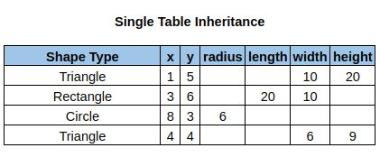
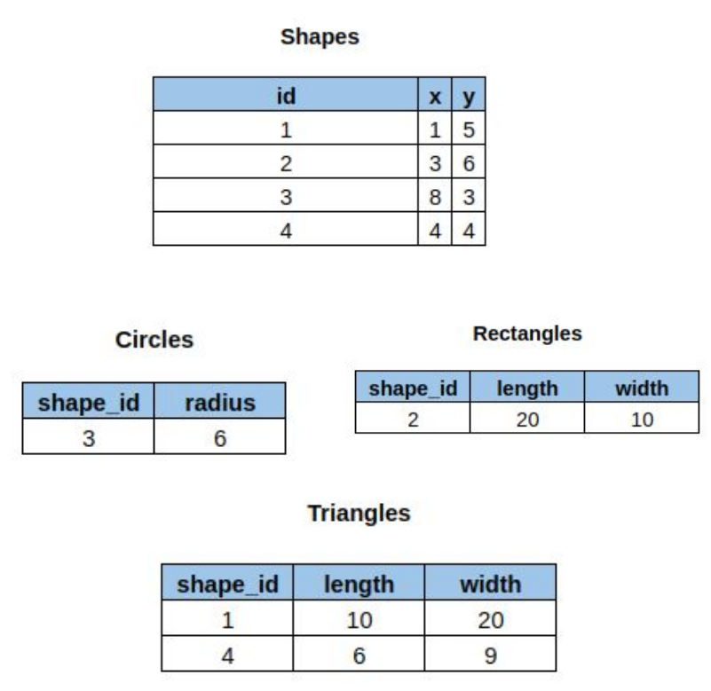
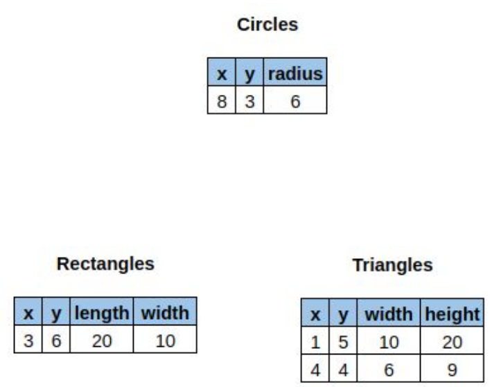

# Database Design & Dealing with Polymorphism

- As you begin working with the database schema, problems will inevitable come up
- You will address them in the database directly
- The E/R diagrams will become increasingly out of date

## Advice On Database Modeling

- Start with E/R diagramming
  - But don’t take it too seriously
- Get to a real world database __ASAP__
- Iterate your app and database as quickly as possible early on when database size is relatively small
- Try to figure out the crucial entities in your system and get those as right as possible
- Read up on stoicism

## Polymorphism & Databases

- Almost all databases are fronted by some software
- That software is written in a particular language
- That language is probably object oriented
  - Java
  - Javascript
  - PHP

### Single Table Inheritance

- A single table is used for all sub-class instances
- The columns are the union of all columns of sub-classes
- Advantages?
  - Fewer Columns
  - Easier todo queries (i.e. only takes one `SELECT`)
- Disadvantages?
  - Lots of wasted space - inefficient

### Class Table Inheritance

- There is one table per class in the object hierarchy
- Sub-classes include a foreign key reference to their parent classes
- Advantages?
  - More normalized model
- Disadvantages?
  - Complexity issues as far as needing to join the tables to get complete information
    - More tables to deal with

> Normalized over time? _"In my experience, this is not the case"_ - Carson

### Concrete Table Inheritance

- There is one table per __concrete__ class in your object hierarchy
- Advantages?
  - Fewer tables than when having a "base class" table
  - Efficient in storing data
  - No need todo an `JOIN`s to get complete information
- Disadvantages?
  - Still more tables than one

## Polymorphism In Practice

- Most systems that I have experience with use a mix:
  - Single Table Inheritance for closely related things with many foreign keys in common
  - Concrete Table Inheritance for more distant relations
  - I have never seen class table inheritance work out well
- My advice is to focus on foreign keys: _the more keys two objects have in common, the more likely you are to prefer single table inheritance_

## The Object-Relational Impedance Mismatch

> “The object-relational impedance mismatch is a set of conceptual and technical difficulties that are often encountered when a relational database management system (RDBMS) is being served by an application program (or multiple application programs) written in an object-oriented programming language or style, particularly because objects or class definitions must be mapped to database tables defined by a relational schema.”

- While inheritance is one issue, there are many others:
  - Encapsulation isn’t part of the relational model
  - Interfaces don’t exist at the relational level
  - Field accessibility isn’t specified at the relational level
  - Database transactions do not map well to objects
  - And so on
- We will discuss this more thoroughly when we talk about Object/Relational mapping tools
