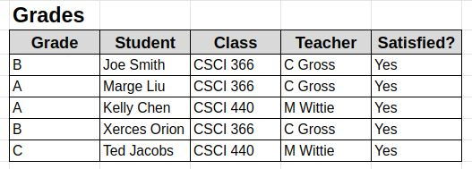
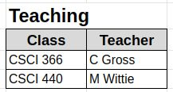
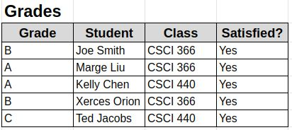
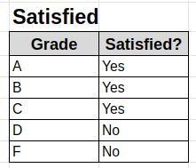

# Database Normalization

- Structuring database tables such that:
  - Redundancy is minimized
  - Data integrity is maximized
- Edgar F Codd: a pioneer in databases
  - Proposed “1st Normal Form” in 1970
  - Went on to propose many more increasingly strict normalized forms
- Most famous Normal Form is BCNF: Boyce-Codd Normal Form
- We will be focusing on
  - 1st Normal Form
  - 2nd Normal Form
  - 3rd Normal Form & BCNF
- BCNF and 3NF are equivalent in the presence of a single column key (surrogate or synthetic key, most tables today)

## Our Database

- Consider the following simple database
- This database is not normalized

### 1st Normal Form

- To Be in 1NF, there must be a key
- Let’s review the concepts and terminology around keys

#### What Are Keys?

- A key is a set of attributes (columns) that _uniquely_ determine a row
- The literature uses the term _superkey_, which makes it sound cool
- In a relation with no duplicates, the set of all columns is a _superkey_
- A _candidate key_ (_aka minimal superkey_) is a key from which no attributes can be removed without causing it to no longer be a key
- The _primary key_ is the candidate key used to identify rows in the relation
- In practice, an ID column is typically added to a relation to be the primary key. This is sometimes called a surrogate or _synthetic key_.

- So, do we have a key in this relation?
- __No__. There are duplicate rows, so no set of columns uniquely identifies a row.

### 2nd Normal Form

- To achieve 2NF, all data must depend on the entire key
- Again, this is trivially true with surrogate keys
  - You can start to see why surrogate keys became a standard

- Is there any data that depends only on part of that key?
  - Teacher depends only on Class!
  - To fix this, we need to pull Teacher data out to a separate table

<table>
    <tr>
        <td>
            
        </td>
        <td>
            
        </td>
    </tr>
</table>

We are now in 2NF

_Note_:

- that `C Gross` and `M Wittie` only appear once
  - Data redundancy has been removed
  - Easier to avoid update errors

### 3rd Normal Form

- We can do better! There is still redundant data here!
- 3NF demands that all data depend _only_ on the key
- What data here that does not depend on the key?

<table>
    <tr>
        <td>
            
        </td>
        <td>
            
        </td>
        <td>
            
        </td>
    </tr>
</table>

- Satisfied does not depend on the key
- Rather, it depends on the Grade column
- OK, so let’s pull that out as well

## Normal Form Summary

- Each non-key column in a relation depends on
  - The key (1NF)
  - The whole key (2NF)
  - And nothing but the key (3NF/BCNF)
  - So help me Cobb ;)
- In the presence of a surrogate key, things become pretty obvious
  - In industry, there is always a surrogate key
- What’s The General Principle?
- Each non-key column in a relation depends on
  - The key (1NF)
  - The whole key (2NF)
  - And nothing but the key (3NF/BCNF)
  - So help me Cobb ;)
- In the presence of a surrogate key, things become pretty obvious
  - In industry, there is always a surrogate key
- What’s The General Principle?

___Don’t Repeat Yourself! (DRY)___

## Denormalizing

- Performance is the biggest reason to denormalize data
- Say you wanted to find all students who didn’t pass a class. The denormalized table would be faster to work with
- No need to merge two tables together, just a simple filter
- Denormalization is basically caching at the database level
- “_There are only two hard things in Computer Science: cache invalidation and naming things._” -- Phil Karlton
- Be careful, but judicious denormalization can be a big win!
