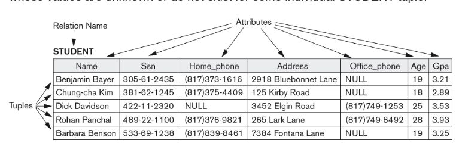

# The Relational Model

- A Relation is a set of Tuples that follow a Relational Schema
- Sounds fancy, but think of Tuples as rows
- Think of the schema as the columns
- The Domain of an attribute is the set of all possible values for that attribute

Example Relational Schema:

    STUDENT(Name, Ssn, Home_phone, Address, Office_phone, Age)

## Constraints In The Relational Model

- Super Key - any combination of attributes for which two distinct tuples will have distinct values
- Minimal Super Key - A super key from which no attributes can be removed and still be a super key
- Candidate Key - A minimal super key
- Primary Key - The Candidate key chose as the official key for the table
- Referential Integrity Constraints are placed on a relational model (and on database tables) to ensure that Foreign Keys point to actual tuples or rows in other relations or tables
- In DBMS systems this are often referred to as Foreign Key Constraints
  - In general, these are expensive
